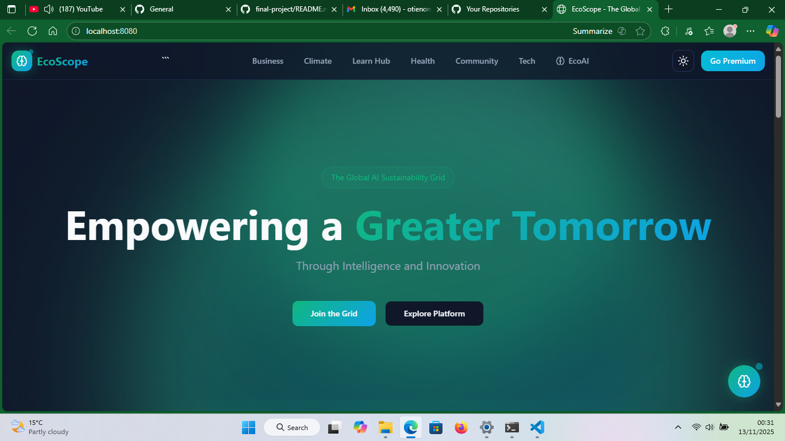

# EcoScope - The Global AI Sustainability Grid

EcoScope is a web-based platform designed to empower individuals, businesses, and communities to act sustainably while leveraging AI tools. It integrates multiple modules, including an **AI-powered local business marketplace**, an **AI virtual assistant for startups**, and a **Skill-to-Income Learning Hub**.  

This platform is built for SMEs, startups, and learners, combining automation, gamification, and sustainability tracking in a single seamless experience.

---


## Table of Contents

- [Features](#features)
- [Tech Stack](#tech-stack)
- [Project Structure](#project-structure)
- [Setup & Installation](#setup--installation)
- [Usage](#usage)
- [Available Scripts](#available-scripts)
- [Contributing](#contributing)
- [License](#license)

---

## Features

### 1. AI-Powered Local Business Marketplace
- Users can sign up as **Suppliers, Retailers, or Customers**.
- Suppliers and Retailers can upload products, run ads, and generate social media posts automatically using AI.
- Customers can browse products, purchase, and track orders.
- Lead tracking dashboard for SMEs.

### 2. AI Virtual Assistant for Startups
- Automates emails, invoices, reminders, and document summaries.
- Dashboard for startups to manage daily operational tasks.
- AI insights to optimize workflows and productivity.

### 3. Skill-to-Income Learning Hub
- Gamified platform to teach monetizable digital skills.
- Flashcards, assignments, and AI-assisted learning tools.
- Real-time leaderboard to encourage engagement.
- AI-powered content generation for learners.

### 4. EcoScope Core Features
- Dynamic dashboards for businesses and users.
- Interactive, animated background with rotating mesh globes.
- Light/Dark theme toggle.
- Responsive design across devices.
- Integration with Supabase for authentication, database, and real-time data.

---

## Tech Stack

- **Frontend:** React, TypeScript, TailwindCSS, Wouter/React Router
- **Backend:** Supabase (PostgreSQL + Auth + Realtime)
- **AI Integration:** OpenAI GPT API, custom AI modules for content, ads, and recommendations
- **State Management:** React Query
- **Animations:** Three.js / Canvas for mesh globes

---

## Project Structure

```text
client/src
├── App.tsx
├── main.tsx
├── index.css
├── components
│   ├── Navbar.tsx
│   ├── ProductCard.tsx
│   ├── MeshBackground.tsx
│   ├── ThemeToggle.tsx
│   └── ui/ (all UI primitives)
├── pages
│   ├── Index.tsx
│   ├── Marketplace.tsx
│   ├── MarketplaceSignup.tsx
│   ├── SellerDashboard.tsx
│   ├── BuyerDashboard.tsx
│   ├── Dashboard.tsx
│   ├── LearnHub.tsx
│   ├── AITools.tsx
│   └── NotFound.tsx
├── hooks
│   ├── useAuth.tsx
│   ├── useToast.ts
├── lib
│   ├── queryClient.ts
│   └── utils.ts
├── integrations
│   └── supabase
│       ├── client.ts
│       └── types.ts
Setup & Installation
Prerequisites
Node.js >= 18

npm or yarn

Supabase account (for database and authentication)

OpenAI API key (for AI-powered features)

Steps
Clone the repository

bash
Copy code
git clone https://github.com/yourusername/ecoscope-business.git
cd ecoscope-business/client
Install dependencies

bash
Copy code
npm install
# or
yarn install
Setup environment variables

Create a .env file in client:

env
Copy code
VITE_SUPABASE_URL=your-supabase-url
VITE_SUPABASE_PUBLISHABLE_KEY=your-supabase-key
VITE_OPENAI_API_KEY=your-openai-api-key
Start the development server

bash
Copy code
npm run dev
# or
yarn dev
The app should now be running at http://localhost:5173.

Usage
Navigate to /marketplace to browse or manage products.

Navigate to /learn to access the Skill-to-Income Learning Hub.

Use /dashboard for business analytics and AI tools.

/ai-tools hosts individual AI features like post generation, lead tracking, and virtual assistant modules.

Available Scripts
npm run dev — Start development server

npm run build — Build production bundle

npm run preview — Preview production build locally

Contributing
Fork the repository

Create a new branch: git checkout -b feature-name

Commit your changes: git commit -m "Description of feature"

Push to branch: git push origin feature-name

Open a Pull Request


EcoScope is designed to accelerate sustainable business growth while integrating AI solutions for efficiency, learning, and automation. 
